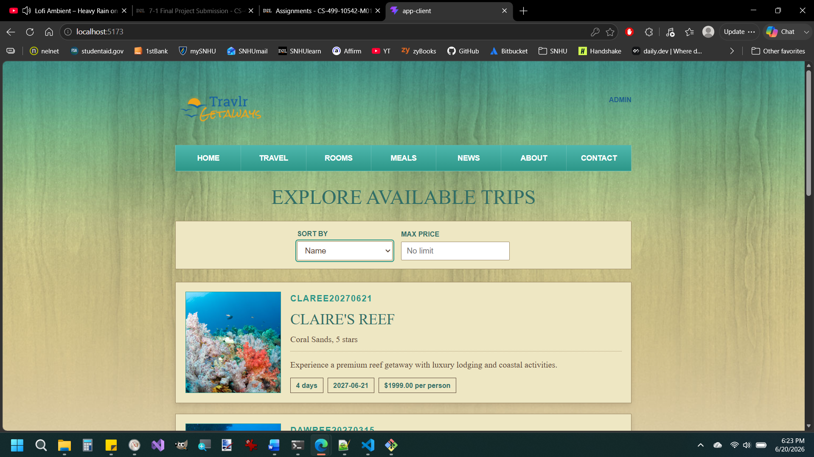
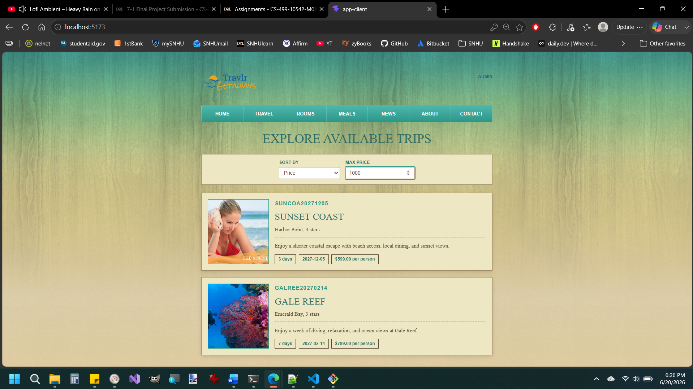
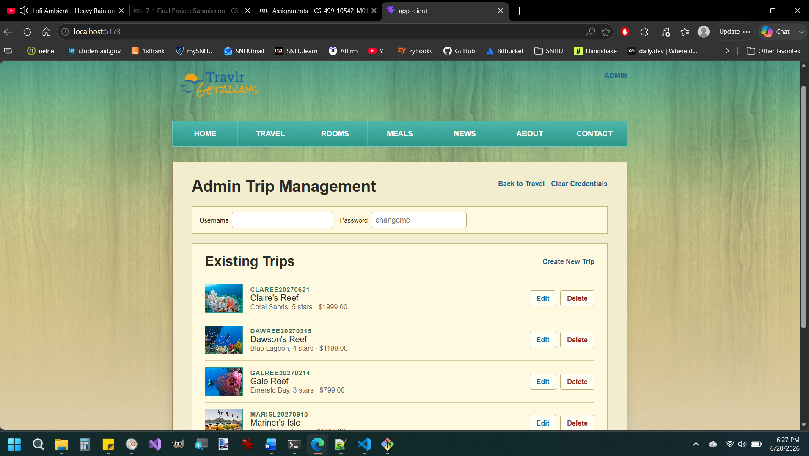

  

# Computer Science Capstone

### Southern New Hampshire University

This ePortfolio presents my final project for CS 499: Computer Science Capstone. My selected artifact is the Travlr Getaways full-stack web application, originally created in CS 465: Full-Stack Development I. Travlr Getaways is a travel application that allows users to browse vacation packages and allows administrators to manage trip information.

For the capstone, I enhanced the project across three core areas of computer science: software design and engineering, algorithms and data structures, and databases. The enhanced version transforms the original MEAN-stack project into a React, Spring Boot, and PostgreSQL full-stack application.

The final project includes a public trip-browsing interface, database-backed search and filtering, and protected administrative trip management. It also strengthens the application through backend validation, Spring Security configuration, automated testing, PostgreSQL persistence, and professional documentation.

## Professional Self-Assessment

The professional self-assessment introduces my experience in the Computer Science program, my capstone work, and the skills demonstrated throughout this ePortfolio. It reflects on my growth in software engineering, algorithms and data structures, databases, security, communication, and professional development.

[Read the Professional Self-Assessment](Self_Assessment.html)

## Code Review

The code review evaluates the original CS 465 Travlr Getaways application before enhancement work began. It examines the original project structure, identifies areas for improvement, and explains the planned enhancement direction for the three core categories.

[Watch the Code Review Video](https://youtu.be/oBbEKwmo_oQ)

## Enhanced Artifact: Travlr Getaways

The original artifact was the CS 465 Travlr Getaways full-stack application. The project was built with the MEAN stack and included static public pages, Express and Handlebars server-rendered routes, REST API routes, MongoDB/Mongoose models, authentication code, and an Angular admin single-page application.

For CS 499, I enhanced this artifact by rebuilding it as a React, Spring Boot, and PostgreSQL application. Because all three enhancement categories build on the same application, the same enhanced codebase is used across the portfolio, with each section focusing on a different area of improvement.

[View the Final Enhanced Project Repository](https://github.com/aaron-eugene/CS-499)

## Enhancement One: Software Design and Engineering

The first enhancement focuses on software design and engineering. In this enhancement, I began restructuring the Travlr application into a clearer full-stack architecture with a React frontend and a Spring Boot backend. The enhanced version separates responsibilities across frontend components, API access code, controllers, DTOs, models, services, repositories, and configuration classes.

This work improves the original artifact by reducing the mixed structure of static pages, server-rendered views, API routes, and Angular admin functionality. It establishes a more maintainable foundation for later work in algorithms, databases, security, and frontend administration.

[View the Software Design and Engineering Enhancement](https://github.com/aaron-eugene/CS-499/tree/milestone-2-software-design)

[Read the Software Design and Engineering Narrative](Milestone_2_Narrative.html)

## Enhancement Two: Algorithms and Data Structures

The second enhancement focuses on algorithms and data structures. In this enhancement, I improved how the Travlr application handles trip data by adding search, filtering, sorting, pagination, defensive input handling, and summary logic. These changes move the project beyond simply returning all trip records and create a more useful and scalable way to retrieve trip information.

The enhanced backend can process user-selected criteria such as price, duration, search text, sort field, sort direction, page number, and page size. The enhancement also adds tests that verify trip search, sorting, filtering, pagination, lookup, and defensive handling of invalid inputs.

[View the Algorithms and Data Structures Enhancement](https://github.com/aaron-eugene/CS-499/tree/milestone-3-algorithms)

[Read the Algorithms and Data Structures Narrative](Milestone_3_Narrative.html)

## Enhancement Three: Databases

The third enhancement focuses on databases. In this enhancement, I migrated the Travlr application from temporary or development-focused data storage toward PostgreSQL-backed persistence using Spring Data JPA and Flyway database migrations. The enhanced version defines a relational trip table, applies database constraints, seeds initial data through migration scripts, and connects the backend repository layer to the PostgreSQL database.

This work improves the original artifact by replacing less structured data handling with a relational schema that better supports validation, uniqueness, indexing, and future growth. The enhancement also preserves the application’s layered architecture by keeping database access behind a repository abstraction.

[View the Databases Enhancement](https://github.com/aaron-eugene/CS-499/tree/milestone-4-databases)

[Read the Databases Narrative](Milestone_4_Narrative.html)

## Final Application Highlights

The final enhanced version of Travlr Getaways includes:

* A React frontend with public trip browsing and an admin management interface
* A Spring Boot REST API with controller, service, repository, DTO, validation, configuration, and security layers
* PostgreSQL persistence with Flyway migrations and database-backed queries
* Trip search, filtering, sorting, pagination, and summary aggregation
* Protected admin create, update, and delete endpoints
* Spring Security HTTP Basic authentication for development admin access
* CORS limited to the configured frontend origin
* Backend tests covering service behavior, defensive input handling, admin CRUD, and admin endpoint security
* A frontend production build with no reported npm vulnerabilities at final review

## Final Application Screenshots

### Public Trip Browsing

The public trip-browsing page displays trip data loaded from the enhanced Spring Boot API and PostgreSQL database.

### Trip Filtering

The filtering view demonstrates the enhanced trip retrieval behavior, including user-selected criteria backed by service and repository logic.

### Admin Trip Management

The admin management page demonstrates protected create, update, and delete functionality for trip records.

## Project Materials

[Final Enhanced Project Repository](https://github.com/aaron-eugene/CS-499)

[Code Review Video](https://youtu.be/oBbEKwmo_oQ)

[Software Design and Engineering Narrative](Milestone_2_Narrative.html)

[Algorithms and Data Structures Narrative](Milestone_3_Narrative.html)

[Databases Narrative](Milestone_4_Narrative.html)
